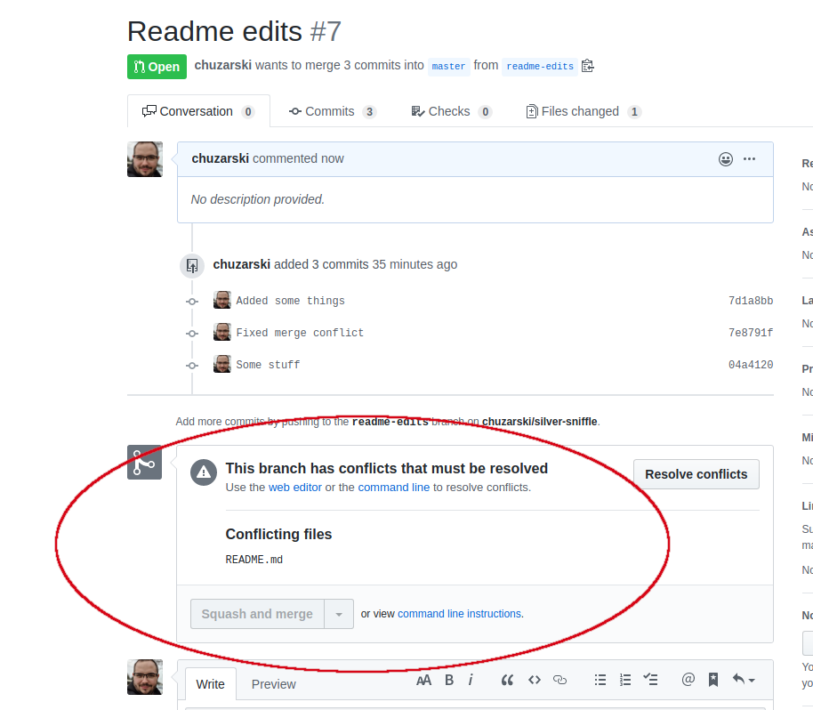

- [After the repository is created](#after-the-repository-is-created)
  - [Managing branches](#managing-branches)
    - [To list branches, just execute](#to-list-branches-just-execute)
    - [Creating branches (3 methods)](#creating-branches-3-methods)
  - [Create branch and make some edits](#create-branch-and-make-some-edits)
    - [Stage changes and commit](#stage-changes-and-commit)
    - [Pulling files out of stage](#pulling-files-out-of-stage)
    - [.gitignore](#gitignore)
- [Push to Github](#push-to-github)
- [Github pull requests and merging](#github-pull-requests-and-merging)
    - [To create a pull request](#to-create-a-pull-request)
- [fetch/pull and merge conflicts](#fetchpull-and-merge-conflicts)
  - [fetch](#fetch)
  - [pull](#pull)
  - [merge conflicts!](#merge-conflicts)
- [Customizing git](#customizing-git)
    - [Change your name](#change-your-name)
    - [Change your email](#change-your-email)
    - [Cache your credentials (it is really annoying to type in your password a million times)](#cache-your-credentials-it-is-really-annoying-to-type-in-your-password-a-million-times)
### Some other resources:
* [Github help](https://help.github.com/en)
* [Github git cheatsheet](https://education.github.com/git-cheat-sheet-education.pdf)
* [Git tutorial (probably better than mine)](https://dev.to/unseenwizzard/learn-git-concepts-not-commands-4gjc)

## Two ways to create a repository
### Local Init
With your terminal:
1. navigate to the root of the directory that you would like to make a repository.
2. execute `git init`

### Create using Github (preferable, comes pre-configured to work with Github)
> We are going to use this method for this guide
1. Create a new github repository with an empty README (.gitignore and license are not required)
2. Navigate to some directory, execute 
```
git clone https://github.com/<youruser>/<yourrepo>.git
```
3. cd into repo directory

# After the repository is created
Git has a concept called "branches." Essentially, a branch is a "timeline" of work that is done. Branches can split off from other branches and eventually merge back together. It is common practice to never DIRECTLY work on the master branch and most projects don't allow commits to the master branch. Work should NEVER be done on the master branch.

> * Rule 1: DO NOT COMMIT ON MASTER
> * Rule 2: DO NOT COMMIT ON MASTER
> * Rule 3: Look at rules 1 and 2

So, to not violate rules 1-3, we're going to create a branch

## Managing branches

### To list branches, just execute
```
git branch
```
or
```
git branch --list
```
### Creating branches (3 methods)

1. Create branch and switch to it
```bash
git branch mynewbranch
git checkout mynewbranch
```

2. Create branch and switch to it (one command). Something to be careful about, this command will base the new branch off the current CHECKED OUT BRANCH (more on checkout later).
```
git checkout -b mynewbranch
```
3. Create branch and switch to it, from a specific branch. In this example, the "master" branch is the specific branch
```
git checkout -b mynewbranch master
```

## Create branch and make some edits
```
git checkout -b readme-edits master
```

Now if you execute `git branch` you will see a * next to the ACTIVE branch (which should be readme-edits). Add some stuff to the README file and save it. Then run:
```
git status
```

### Stage changes and commit
To tell Git to track changes in a file, you need to stage that file. Two ways to do that:
1. Tell git to stage changes for a single file
```
git add README.md
```
2. Tell git to stage changes for ALL files
```
git add .
```
Typically the second one is used, so in this case, we will execute `git add .` If you run `git status`, it will now show you that the file is staged for changes. To **commit** the changes to the repository, we are going to execute
```
git commit -m "Added some stuff to README!"
```
* `-m` means message. Adding messages to a commit is **crucial** since it's a nice summary of the work that you have done

### Pulling files out of stage
If we accidentally stage a file that we __DO NOT__ want to commit, we can pull it out of the stage by executing
```
git restore --staged <filename>
```
We can also unstage __ALL__ in almost the same way as we do with add:
```
git restore --staged .
```

### .gitignore
Git has a cool feature that allows you to ignore files that you __DO NOT WANT__ in your repository. For example, files with passwords, API keys, editor settings, local settings even whole entire directories. This file is called `.gitignore`
Example contents of this file:
```
keys.txt
*.rtf
/build/
```
Note: `*.rtf causes git to ignore all rtf files`
git 
# Push to Github
So far, all the work we have done is **LOCAL** to our machine and has not been shared with anyone else. To do that, we have to push it to Github. To push, we execute
```
git push <remote> <branch>
```
So in our case, we are going to execute
```
git push origin readme-edits
```
Cool!

# Github pull requests and merging
So, for all the work to show up into master, it needs to be merged. Managing merges on github is pretty easy to do with pull requests. The basic idea behind them is to review proposed changes to master before they are made.
### To create a pull request
1. Go to the repo. On the left side there is a drop-down selection for branches. Select your newly pushed branch


1. After it is selected, click the "New pull request" button


3. Fill out the form (what the commit does) and create pull request


4. Merge it when reviewed


After the pull request is reviewed by everyone, it can be merged!

# fetch/pull and merge conflicts
## fetch

Executing `git fetch` on your currently checked out branch will essentially pull down __the fact that__ there were changes made in the __currently__ checked out branch

This will pull down the differences between your __currently__ checked out branch and master
```
git fetch origin master
```

## pull
Pull works similar to fetch, except that in addition to fetching the changes, it will attempt to __merge__ them

This will attempt to merge changes from the remote
```
git pull
```

This will attempt to merge changes from the master branch, from the remote, into the __currently checked-out branch__
```
git pull origin master
```
## merge conflicts!
Let's try to cause a merge conflict

1. Create a new branch
```
git checkout -b newstuff
```
2. Add some stuff into the README.md file
3. Add/Commit/Push

```
git add .
git commit -m "Some stuff!"
git push origin newstuff 
```
4. Merge with master on Github
5. Switch to the readme-edits branch

```
git checkout readme-edits
```
6. Add some stuff into the README.md file
7. Add/commit/push
```
git add .
git commit -m "Some stuff!"
git push origin readme-edits 
```
8. Attempt to merge on Github.. And...



Fixing this:
1. while on the readme-edits branch:
```
git pull origin master
```
2. Edit any conflicting files
3. Add/commit/push
4. You should be able to merge the readme-edits into master now

# Customizing git
### Change your name
```
git config --global user.name "Firstname Lastname"
```

### Change your email
```
git config --global user.email "email@somewhere.ru"
```

### Cache your credentials (it is really annoying to type in your password a million times)
```
git config --global credential.helper 'cache --timeout=3600'
```

> the --global flag will apply these settings to all repositories for YOUR user on YOUR computer
> 
> if you don't use the global flag, it will only apply to __the current repo__ that you are working with